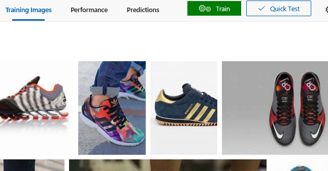
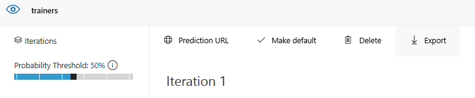
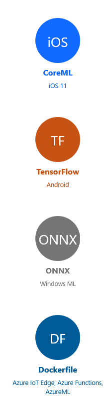
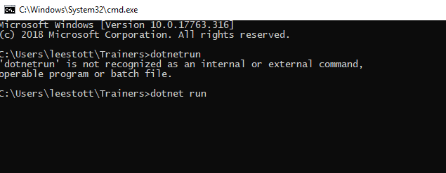
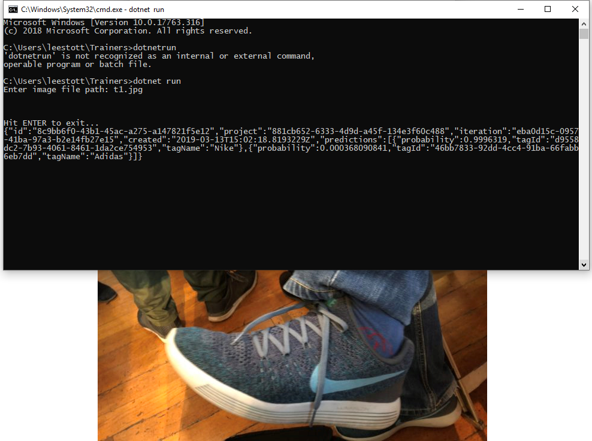

## Step 1: Building and training our model

As with all machine learning projects, the first thing to do is to build and train our model. Custom Vision Service is a tool for easily training,deploying, and improving custom image classifiers. You can use just a few images per each category to  train your own image classifier in minutes, with decent results. 

To get started, go to https://customvision.ai. You'll be greeted by a page allowing you to create a new model (or a list of models if you have them already).


## Step 2 Upload the Images

Once the model is created, it's time to start loading our images and tagging them. see [BingImageCLI](/BingImageCLI)

Or you can add the images manually via the CustomVision AI Portal


You will have the option to tag the images as they are uploaded.

## Step 3. Train the Model
Train the model
When we've uploaded the photos, we're only half way through. Now we need to actually train the model to do something based on those images. There is a big green button at the top called Train.


The nice thing is that you also immediately see how good the training data seems to be. As you move forward with the model, you will likely end up with multiple iterations which you are able to get back to. 

## Step 4. Exporting the Model for Mobile Dev

Export button on top of the Performance page.



When we click the Export you can choose either CoreML (iOS 11) or TensorFlow (Android), ONXX Windows ML or DockerFile for Azure IOT Edgem Azure Functions, AzureML 


## Step 5. Building an App

See some samples at [Here](https://github.com/Azure-Samples/cognitive-services-ios-customvision-sample)

For this iOS example you simply need to tell the code to use it. To do that, we will be changing ViewController .
Specifically, there is a line of code that initialises the CoreML model and we need it to look like this:

```
let model = try VNCoreMLModel(for: Drinks1().model)
```
Obviously, the key thing for us is the Drinks1  name, representing the class generated from the model we've imported.

There is an example of a C# App using a Tensorflow Model in the folder called [CustomVision-TensorFlow-CSharp-Master](/CustomVision-TensorFlow-CSharp-Master)

## Step 6. Test the app

See the readme and instructions at [CustomVision-TensorFlow-CSharp-Master](/CustomVision-TensorFlow-CSharp-Master) What is important is that this is fully offline, so it doesn't need a connection to the internet. So, we've trained our own model using Microsoft's pre-built and optimised networks, exported that  model and used it straight from an app.

## Step 7 Creating REST API from a .NET Core App 

Your model may be evolving constantly, etc. There is a prediction API available and exposed from the service as well meaning that for each model you build, you can also get an API endpoint to which you can send either an image URL or the image itself, and get back a prediction.

Setting up .NETCode make sure you're environment is setup by following the instructions here. Next, launch a terminal and create a new Console app and run

```
dotnet new console --name MyAppName
```
Then, open the Program.cs in your favourite editor I have provided a sample in this repo. There are two placeholders for your prediction URL and prediction key. You get the latter when you open the model in Custom Vision and click on the little World icon labelled predication Key.


You then need to open the Settings tab in the upper right corner and get the Subscription key. Once that's updated in the code, you can build and run it, either from Visual Studio Code, or from the terminal.

To run Program.CS simply open a command window in the program.cs root folder and run 

```
dotnet run
```

This will load the app and ask you for a image file path


And as you can see from this example I was wearing a pair of Nike Trainers 

With the CustomVision saying there was a probability of 99.96%
