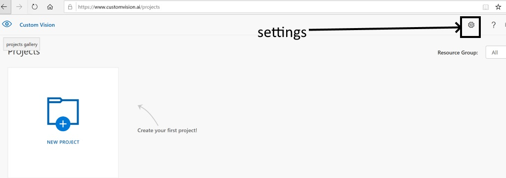
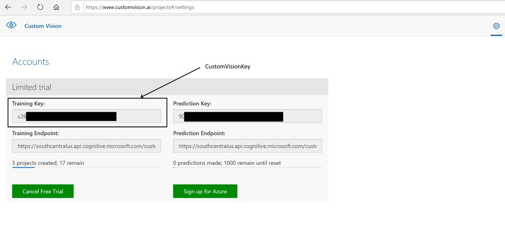

# Custom Vision Model CLI - with image uploading, tagging and training
Cross platform CLI to provision a new Microsoft Custom Vision model using images stored on your local machine.  Images are automatically uploaded and tagged using folder names and the model is trained ready for predications.

To learn more about Microsoft Cognitive Custom Vision Service, please see here: https://azure.microsoft.com/en-gb/services/cognitive-services/custom-vision-service/

## Custom Vision API Key
To retrieve your Custom Vision API key start here: http://www.customvision.ai 

Click on the Setting Cog on the top right



Then copy the key required


## CLI Arguments

| Argument name | shortcut | example |
|----|----|----|
| CustomVisionAPIKey | -k | asdfasdfasdfsaf |
| ProjectName | -n | PaperclipOrClippy | 
| ImagePath | -p | c:\photos |
| Timeout (minutes) | -t | 10 |
| QuickTest | -q | |

## Usage

### Model creation, image upload & training
Upload all subfolders of images under the c:\\photos\ path.  Folder names are comma separated to specify multiple tags eg:
"c:\photos\cucumber,vegetable" will upload all images in the folder: "c:\photos\cucumber,vegetable" and tag them with both "cucumber" and "vegetable" tags.
```
CustomVisionCLI.exe -k *yourcustomvisionapikey* -n CucumberOrCourgette -p c:\photos
```
Uploading multiple tags

So after using BingCLI to download multiple tags

Example 
```
BingImageCLI.exe -k *yourbingapikey* -s "Microsoft Clippy, paperclip, office" -p c:\photos
```

You can upload these using the following command 

```
CustomVisionCLI.exe -k *yourbingapikey* -s -p "c:\photos" -n MSOffice
```

Output Example of multi tag

```
Creating Custom Vision Project: MSOffice 
Scanning subfolder within c:\photos
Creating Tag: Microsoft Clippy
Creating Tag: paperclip
Creating Tag: office
Uploading: c:\photos\Microsoft Clippy, paperclip, office images....
Training Model
Model status: Training
Model status: Training
Model status: Training
Model status: Training
Model status: Training
Model status: Training
Model status: Training
Model status: Completed
Iteration: be14fd6c-0447-467e-b9e9-21a260a01d49 set as default
Done.
Total time: 00:01:32.9939707
```

### Model quick test
Quickly test your model with a single image to see the outcome prediction

```
CustomVisionCLI.exe -k yourcustomvisionkey -p "folder location" -n projectname -q
```

```
CustomVisionCLI.exe -k bb******************** -p "c:\pics\legs\leg1.jpg" -n hotdogs -q
```